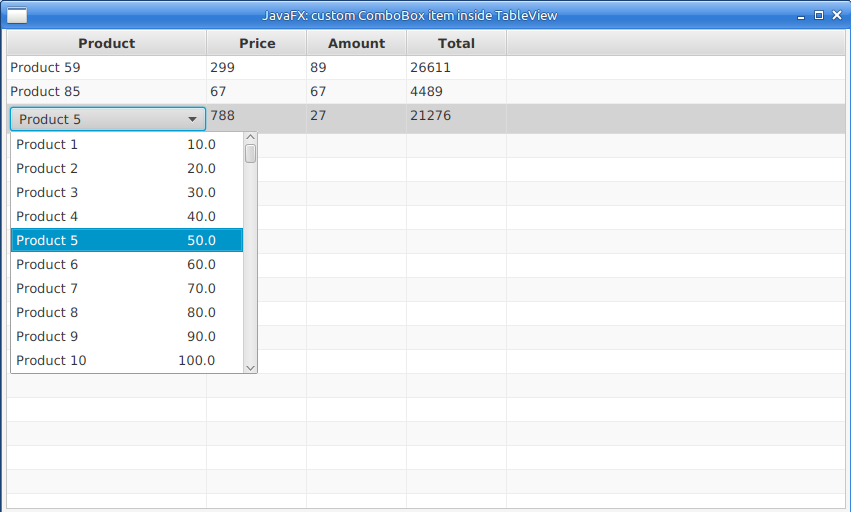

# JavaFXCustomComboBoxItemInTableView
JavaFX How To: custom ComboBox item inside TableView

This project shows how to make custom ComboBox list item, which is inside cell of the TableView.
Hope it will be helpful.

It's how dialog looks like:

